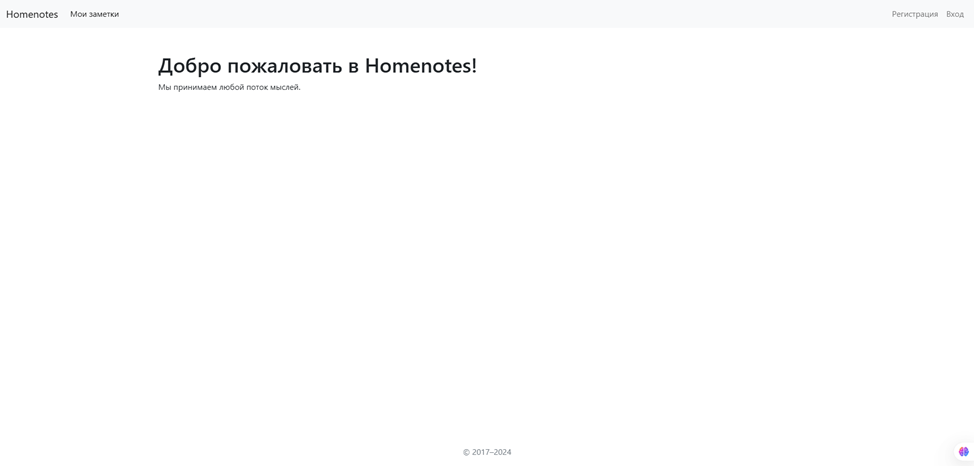

# Анализ и сравнение написания web-приложений с использованием разных фреймворков: Django, FastAPI, Flask

## Содержание
1. [Задачи проекта](#задачи)
2. [Описание проекта](#описание)
3. [Требования](#требования)
4. [Установка](#установка)
5. [Структура проекта](#структура)
6. [Сравнение Django, Flask, FastAPI. Плюсы и минусы веб-фреймворков](#сравнение)
7. [Использование](#использование)
8. [Заключение](#заключение)

<a id="задачи"></a>
## Задачи проекта
Этот проект предназначен для сравнения трех популярных фреймворков Python для веб-приложений: Django, FastAPI, Flask.
Мы изучим и проанализируем основные веб-фреймворки – Django, Flask и FastAPI – с целью выявления их характеристик, 
преимуществ и недостатков, а также определения оптимальных условий для их использования в разработке веб-приложений.


<a id="описание"></a>
## Описание проекта
В рамках реализации проекта мы сравним трех популярных фреймворков Python для веб-приложений и создадим на одном из них 
веб-приложение.


<a id="требования"></a>
## Требования
alembic==1.14.0
annotated-types==0.7.0
anyio==4.7.0
asgiref==3.8.1
blinker==1.9.0
cachelib==0.13.0
click==8.1.7
colorama==0.4.6
Django==4.2.17
exceptiongroup==1.2.2
fastapi==0.115.6
Flask==3.1.0
Flask-Session==0.8.0
greenlet==3.1.1
h11==0.14.0
idna==3.10
importlib_metadata==8.5.0
itsdangerous==2.2.0
Jinja2==3.1.4
Mako==1.3.8
MarkupSafe==3.0.2
msgspec==0.18.6
passlib==1.7.4
pydantic==2.10.3
pydantic_core==2.27.1
python-multipart==0.0.19
sniffio==1.3.1
SQLAlchemy==2.0.36
sqlparse==0.5.2
starlette==0.41.3
typing_extensions==4.12.2
tzdata==2024.2
uvicorn==0.32.1
Werkzeug==3.1.3
zipp==3.21.0


<a id="установка"></a>
## Установка
1. Для установки проекта необходимо выполнить установку библиотек. Её можно выполнить по следующей команде:
```sh
pip install -r requirements.txt.
```
2. Создайте и активируйте виртуальную среду
```
   python -m venv venv
   venv\Scripts\activate  # Для Windows
   source venv/bin/activate  # Для Linux / Mac
```
3. Установите зависимости
```
   pip install -r requirements.txt
```
4. Запустите веб-приложение из его корневой дирректории
```
#Django
cd Django/DjangoProject/DjangoProject
python manage.py runserver

#FastAPI
cd FastAPI/FastAPIProject
uvicorn main:app

#Flask
cd Flask
python run.py

```
5. Откройте браузер и перейдите на [http://localhost:8000](http://localhost:8000)(для Django FastAPI)
или на [http://localhost:5000](http://localhost:5000)(для Flask)

<a id="структура"></a>
## Структура проекта
```
.
├── README.md
├── requirements.txt
├── Django
│   └── DjangoProject
│       ├── db.sqlite3
│       ├── manage.py
│       ├── DjangoApp
│       │   ├── __init__.py
│       │   ├── admin.py
│       │   ├── apps.py
│       │   ├── forms.py
│       │   ├── models.py
│       │   ├── tests.py
│       │   ├── views.py
│       │   ├── migrations
│       │   │   └── __init__.py
│       │   └── __pycache__
│       ├── DjangoProject
│       │   ├── __init__.py
│       │   ├── asgi.py
│       │   ├── settings.py
│       │   ├── urls.py
│       │   └── wsgi.py
│       └── templates
│           ├── homenotes.html
│           ├── login.html
│           ├── menu.html
│           └── register.html
├── FastAPI
│   └── FastAPIProject
│       ├── alembic.ini
│       ├── db_users.db
│       ├── main.py
│       ├── schemas.py
│       ├── backend
│       │   └── db.py
│       ├── migrations
│       │   ├── env.py
│       │   ├── README
│       │   ├── script.py.mako
│       │   └── versions
│       ├── models
│       │   └── user.py
│       ├── router
│       │   └── user.py
│       ├── templates
│       │   ├── homenotes.html
│       │   └── login.html
│       └── __pycache__
├── Flask
│   ├── db_users.db
│   ├── run.py
│   ├── app
│   │   ├── __init__.py
│   │   ├── db.py
│   │   ├── models.py
│   │   ├── routes.py
│   │   ├── schemas.py
│   │   └── templates
│   │       ├── homenotes.html
│   │       ├── login.html
│   │       ├── menu.html
│   │       └── register.html
│   └── flask_session
└── img


```

<a id="сравнение"></a>
## Сравнение Django, Flask, FastAPI. Плюсы и минусы веб-фреймворков.

**Django**

Django — дедушка веб-фреймворков Python, и на то есть веские причины. Это фреймворк «с батарейками», то есть он поставляется со всеми предустановленными инструментами, необходимыми для создания полнофункционального веб-приложения — ORM, аутентификация пользователей, панель администратора и многое другое.

**Основные характеристики**

Готовая функциональность: с Django вы получаете все необходимое для создания полностью функционального веб-приложения без особой дополнительной настройки.
Надежный ORM: ORM Django — это сильная сторона, позволяющая взаимодействовать с базой данных в стиле Python, что может ускорить разработку и сократить необходимость в чистом SQL.
Интерфейс администратора: Встроенный интерфейс администратора Django легендарен. Он обеспечивает мгновенный, настраиваемый бэкэнд для управления данными вашего приложения без необходимости кодировать его с нуля.
Безопасность: Django поставляется со встроенными функциями безопасности для защиты от распространенных атак, таких как SQL-инъекции, XSS и CSRF. Он разработан для продвижения лучших практик безопасности с самого начала.

**Преимущества Джанго**

Несмотря на наличие собственной номенклатуры, он генерирует HTTP-ответы, а также ядро фреймворка можно рассматривать как архитектуру MVC (модель-представление-контроллер). Архитектура обычно используется для разработки пользовательских интерфейсов, состоящих из трех основных компонентов. Базовая структура и компоненты архитектуры MVC представлены на следующем рисунке.
Модель управляет данными приложения, представление отображает пользовательский интерфейс модели, а контроллер управляет вводом и взаимодействием между пользователем и моделью.
Фреймворк состоит из ORM (объектно-реляционного картографа), реляционной базы данных, системы веб-шаблонов и диспетчеров URL. Где ORM связывает модели, HTTP-запросы обрабатываются реляционной базой данных и. Диспетчер URL является контроллером на основе регулярных выражений.
Пакет contib фреймворка Django используется для объединения ряда приложений. Мы можем разрешить код тиреоидной вечеринки в работающем проекте с помощью системы конфигурации Django. Он следует соглашению о повторно используемых приложениях.
В фреймворке у нас есть более 2500 пакетов с решением проблемы, на которой это не работает. Это может быть полезно для расширения поведения фреймворка.
Фреймворк автоматически обеспечивает защиту от большинства типичных веб-атак, таких как подделка межсайтовых запросов, межсайтовый скриптинг, SQL-инъекция, взлом паролей. Также его можно рассматривать как инструмент для создания карт сайтов Google и приложений ГИС. 
Django предоставляет REST Framework с мощными функциями API. REST Framework имеет встроенный браузер API для тестирования конечных точек, а Django с REST Framework предоставляет возможность аутентификации и правил разрешений с помощью Framework.

**Недостатки Джанго**

Фреймворки Django не имеют соглашений. Часто при настройке «на ходу» компоненты не совпадают. Поскольку все должно быть четко определено в процессе, это приводит к снижению скорости разработки.   
Иногда Django не подходит для небольших проектов с небольшим количеством функций, поскольку функциональность фреймворка может сбить с толку разработчика.
Очень малое количество зависимостей фреймворка делает Django монолитным, при этом при разработке нам нужно рассматривать фреймворк как единый пакет. Меньшее количество зависимостей делает разработку завершенной с большим объемом кода.
Django предлагает множество функций и конфигураций, поэтому пользователь не может быстро его освоить.
Запрос каждого отдельного процесса замедляет процесс разработки Django.

**Когда использовать Django**

Django идеально подходит для больших и сложных приложений, где вам нужно много встроенных функций. Если вы создаете приложение, управляемое данными, например, платформу электронной коммерции, сайт социальных сетей или CMS, обширные функции и механизмы безопасности Django делают его надежным выбором. Тем не менее, для небольших приложений это может показаться использованием кувалды для раскалывания ореха.

**Flask**

Flask — это минималистский фреймворк из этого трио, и его философия — гибкость и простота. В отличие от Django или FastAPI, Flask не поставляется с большим количеством встроенных инструментов, но в этом и суть. Flask поощряет разработчиков создавать только то, что им нужно, предоставляя основные элементы для начала работы.

**Основные характеристики**

Минималистский и модульный: Flask часто описывается как «микрофреймворк», потому что он предоставляет основы: маршрутизацию, шаблоны и сервер разработки. Затем разработчики могут подключать нужные им функции, такие как ORM или валидация форм.
Идеально подходит для новичков: простота Flask делает его отличным выбором для новичков или для небольших проектов, не требующих особых наворотов.
Отличное сообщество и расширения: несмотря на свою легкость, Flask имеет обширную экосистему расширений для ORM, аутентификации и других функций. Вы можете превратить Flask в мощный инструмент без ненужного раздувания.
Преимущества Flask
Мы можем безопасно и легко изменять большинство деталей фляги благодаря ее простоте и минимализму.
Мы можем создавать несколько приложений или серверов, используя модульные коды flasks, которые могут быть распределены по большой сети, каждый со своими конкретными задачами. Это делает приложения более эффективными и производительными.
При лучшем понимании Python становится проще разрабатывать приложения Flask. 
Разработанное Flask приложение более масштабируемо, чем монолитное приложение. Так как, согласно новым методам, приложение работает в контейнерах с автомасштабированием. Монолитные приложения не масштабируются сами по себе.

**Недостатки Flask**

Flask не стандартизирован в большинстве организаций. Знания о любом фреймворке, которые мы получаем с помощью flask, не помогают в других фреймворках, таких как Django. Поэтому иногда становится сложно перейти с flask на любой другой фреймворк.
Меньшее количество инструментов заставляет разработчика разрабатывать больше вещей самостоятельно, или нам приходится искать много библиотек и расширений для завершения развертывания.
В большинстве случаев сети приложений имеют один источник, который должен обрабатывать запросы один за другим, независимо от количества запросов одновременно, что увеличивает время выполнения приложения.

**Когда использовать Flask**

Flask — это фантастический выбор для небольших и средних проектов, где простота — ключ. Он также идеален, если вы предпочитаете модульный подход, выбирая только нужные вам библиотеки. Например, если вы создаете личный блог, MVP для стартапа или небольшой инструмент, то прямолинейность Flask трудно превзойти.

**FastAPI**

FastAPI ворвался на сцену веб-разработки Python, быстро став лучшим выбором для создания API. Благодаря таким функциям, как асинхронная обработка запросов, подсказка типов и автоматическая генерация документации OpenAPI, FastAPI является высокоэффективной и удобной для разработчиков средой.

**Основные характеристики FastAPI**

Blazing Fast: как и следует из названия, FastAPI невероятно быстр благодаря использованию асинхронного программирования (asyncio). Это делает его лучшим выбором для приложений, которым необходимо быстро обрабатывать большой объем запросов, например, чат в реальном времени или высоконагруженные микросервисы.
Разработка на основе типов: с FastAPI вы можете использовать подсказки типов Python для автоматического создания интерактивных документов API. Эта функция не только повышает производительность, но и снижает вероятность ошибок.
Swagger и Redoc: FastAPI автоматически генерирует интерактивную документацию API с помощью Swagger UI и ReDoc, что упрощает тестирование и взаимодействие с API.

**Преимущества FastAPI**

FastAPI помогает проверять тип данных от разработчика даже во вложенных запросах JSON.
 Он предоставляет функцию автозаполнения, которая помогает создавать приложения с меньшими усилиями и меньшим временем на отладку. 
Он основан на OpenAPI (открытый API — это общедоступный интерфейс прикладного программирования, который предоставляет разработчикам программный доступ к фирменному программному приложению или веб-сервису) и совместим с ними, а также с JSON Schema (JSON Schema — это словарь, который позволяет аннотировать и проверять документы JSON).
FastAPI упрощает создание API GraphQL с помощью библиотеки Python под названием graphene-python.
FastAPI хорошо интегрируется с OAuth 2.0 и внешними провайдерами.

**Недостатки FastAPI**

FastAPI — относительно новый фреймворк, поэтому сообщество руководств невелико. У нас меньше внешней образовательной информации, такой как книги, курсы или руководства.
Так как при разработке приложений нам необходимо связать все воедино в приложении FastAPI, из-за чего основной файл становится очень длинным или переполненным.

**Когда использовать FastAPI**

FastAPI отлично подходит для ситуаций, где скорость и масштабируемость являются главным приоритетом, например, при создании надежного API для вашего мобильного приложения или архитектуры микросервисов. Однако это не полноценный фреймворк, поэтому, если вашему приложению требуются сложные пользовательские интерфейсы или полноценный бэкенд, вам может потребоваться объединить его с другим инструментом.


<a id="использование"></a>
## Использование
- Главная страница: 


- Регистрация: Создайте новый аккаунт, перейдя на /register/.


- Вход/Выход: Войдите в систему на странице /login/ и выйдите на странице /logout/.


<a id="заключение"></a>
## Заключение
В ходе исследования веб-фреймворков Django, Flask и FastAPI было выявлено, что каждый из них обладает своими 
уникальными преимуществами и недостатками. Django, как фреймворк "всё включено", обеспечивает мощные возможности 
для быстрого развертывания сложных приложений с чёткой архитектурой и встроенными инструментами для работы с базами 
данных и аутентификацией пользователей. Это делает его подходящим выбором для разработки крупных и комплексных 
проектов, таких как система заметок, реализованная в данном дипломном проекте.
В рамках дипломного проекта было разработано веб-приложение "Заметки" на Django, демонстрирующее все плюсы 
использования этого фреймворка в реальных условиях. Реализованные функциональные возможности подтвердили, что 
Django позволяет быстро и эффективно создавать удобные и функциональные веб-приложения.
Таким образом, выбор фреймворка должен основываться на конкретных требованиях проекта, предпочтениях команды 
разработчиков и особенностях конечного продукта. Понимание сильных и слабых сторон каждого из фреймворков поможет 
разработчикам принимать более обоснованные решения, что в конечном итоге приведёт к созданию более успешных и 
эффективных веб-приложений.
